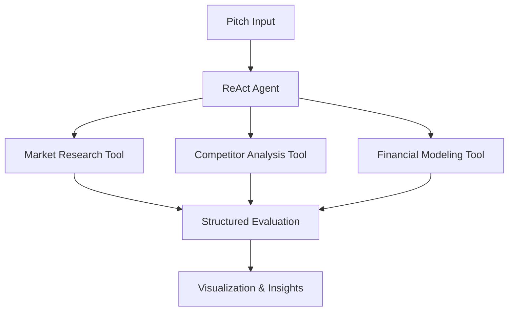

# 🚀 PitchPal - AI Startup Pitch Evaluator

[](https://pitchpal-ai-agent-for-startup-pitch-evaluation.streamlit.app/)
[](https://www.python.org/downloads/)
[](https://python.langchain.com/)
[](https://openai.com/)
[](https://opensource.org/licenses/MIT)

**A sophisticated AI-powered platform that evaluates startup pitches using advanced LangChain agents and OpenAI GPT-4**

🌟 **[Try Live Demo](https://pitchpal-ai.streamlit.app/)** | 📖 **[View Code](https://github.com/Jeet-51/PitchPal-AI-Agent-for-Startup-Pitch-Evaluation)**

---

## 📖 Project Overview

PitchPal demonstrates cutting-edge AI capabilities by combining **LangChain's agent framework** with **OpenAI's GPT-4** to create an intelligent startup pitch evaluation system. This portfolio project showcases advanced AI engineering skills through practical application.

### 🎯 **Key Achievement**
Successfully implemented **ReAct (Reasoning + Acting) AI agents** that dynamically evaluate startup pitches across 5 critical dimensions, providing structured insights comparable to professional venture capital analysis.

---

## ✨ Features Demonstrated

### 🤖 **AI Agent Architecture**
- **ReAct Agent Pattern**: Dynamic decision-making with reasoning chains
- **Custom Tool Integration**: Market research, competitor analysis, financial modeling
- **Structured Output**: Pydantic models for consistent data validation
- **Error Handling**: Graceful fallbacks and robust parsing

### 📊 **Evaluation Engine**
- **5-Dimension Analysis**: Problem clarity, market opportunity, business model, competitive advantage, team strength
- **Dynamic Scoring**: 0-10 scale with confidence intervals
- **Investment Recommendations**: Buy/Hold/Pass decisions with reasoning
- **Visual Analytics**: Radar charts, score breakdowns, trend analysis

### 🔄 **Dual Processing Methods**
1. **AI Agent (ReAct)** - Advanced agent-based evaluation with tool usage
2. **Sequential Chains** - Linear LangChain processing for comparison

---

## 🛠️ Technologies & Frameworks

| Category | Technology | Purpose |
|----------|------------|---------|
| **AI Framework** | LangChain 0.1.0 | Agent orchestration, chains, tools |
| **Language Model** | OpenAI GPT-4 | Natural language understanding & generation |
| **Frontend** | Streamlit 1.29.0 | Interactive web interface |
| **Backend** | FastAPI 0.104.1 | RESTful API with LangServe |
| **Data Validation** | Pydantic 2.5.0 | Structured data models |
| **Visualization** | Plotly 5.17.0 | Interactive charts and analytics |
| **Deployment** | Streamlit Cloud | Production hosting |

---

## 🚀 Live Demo Features

### 🏠 **Main Interface**
- **Intuitive Design**: Clean, professional UI with sidebar navigation
- **Real-time Evaluation**: Dynamic pitch analysis with progress indicators
- **Method Selection**: Choose between AI Agent and Sequential Chain approaches
- **Educational Tooltips**: In-app explanations of LangChain concepts

### 📈 **Analytics Dashboard**
- **Evaluation History**: Track all pitch assessments over time
- **Performance Metrics**: Success rates, average scores, trend analysis
- **Visual Insights**: Color-coded charts showing startup performance
- **Comparative Analysis**: Side-by-side evaluation comparisons

### 🎯 **Detailed Results**
- **Radar Visualization**: Multi-dimensional performance analysis
- **Score Breakdown**: Horizontal bar charts with color coding
- **Detailed Insights**: Expandable sections with reasoning and suggestions
- **Action Items**: Categorized strengths, concerns, and next steps

---

## 💻 Quick Start

### Prerequisites
- Python 3.8 or higher
- OpenAI API Key ([Get one here](https://platform.openai.com/api-keys))

### Installation

1. **Clone the repository**
```bash
git clone https://github.com/Jeet-51/PitchPal-AI-Agent-for-Startup-Pitch-Evaluation.git
cd PitchPal-AI-Agent-for-Startup-Pitch-Evaluation
```

2. **Install dependencies**
```bash
pip install -r requirements.txt
```

3. **Configure environment**
```bash
cp .env.example .env
# Edit .env and add your OpenAI API key
```

4. **Run the application**
```bash
streamlit run app.py
```

5. **Access the app**
```
Local: http://localhost:8501
Network: http://your-ip:8501
```

---

## 🎮 Usage Guide

### **Method 1: AI Agent (ReAct) - Recommended**

1. **Select "AI Agent (ReAct)"** from the evaluator dropdown
2. **Enter startup details** or choose from sample pitches
3. **Click "Evaluate Pitch"** to trigger the agent workflow
4. **Watch the reasoning process** as the agent:
   - Analyzes the pitch content
   - Calls market research tools
   - Performs competitor analysis
   - Evaluates financial models
   - Generates structured insights

### **Method 2: Sequential Chains**

1. **Select "Sequential Chains"** for linear processing
2. **Input pitch information** 
3. **Receive text-based analysis** with extracted insights

### **Analytics Exploration**

1. **Navigate to Analytics** to view evaluation history
2. **Explore performance trends** across different startups
3. **Compare evaluation methods** and their outcomes

---

## 🏗️ Technical Architecture

### **AI Agent Workflow**


### **Core Components**

#### 🤖 **EvaluationAgent Class**
```python
class EvaluationAgent:
    def __init__(self):
        self.llm = ChatOpenAI(model="gpt-4")
        self.tools = [MarketResearchTool(), CompetitorAnalysisTool(), FinancialModelingTool()]
        self.agent = create_react_agent(self.llm, self.tools, prompt)
```

#### 🛠️ **Custom Tools**
- **MarketResearchTool**: Industry analysis and market sizing
- **CompetitorAnalysisTool**: Competitive landscape evaluation
- **FinancialModelingTool**: Business model viability assessment

#### 📊 **Structured Output**
```python
class PitchEvaluation(BaseModel):
    startup_name: str
    overall_score: float
    investment_recommendation: str
    problem_clarity: DimensionScore
    market_opportunity: DimensionScore
    # ... additional dimensions
```

---

## 📊 Sample Evaluation Results

### **High-Performance Startup Example**
- **Overall Score**: 8.4/10
- **Investment Recommendation**: Buy
- **Strengths**: Clear problem definition, large market, proven traction
- **Key Insights**: Strong technical metrics with validated pilot results

### **Analytics Insights**
- **Total Evaluations**: 5 completed assessments
- **Agent vs Chain**: 4 agent evaluations, 1 chain evaluation  
- **Score Range**: 6.0 - 7.4 across different startup types
- **Success Rate**: 80% of evaluations recommend investment consideration

---

## 🎓 Learning Objectives Achieved

### **LangChain Mastery**
- ✅ **Agent Implementation**: ReAct pattern with dynamic tool selection
- ✅ **Chain Orchestration**: Sequential processing workflows
- ✅ **Custom Tools**: Domain-specific analysis capabilities
- ✅ **Memory Management**: Conversation context and state handling
- ✅ **Output Parsing**: Structured data extraction with validation

### **Production Skills**
- ✅ **API Design**: RESTful endpoints with FastAPI
- ✅ **UI/UX Development**: Professional Streamlit interface
- ✅ **Error Handling**: Robust failure management and recovery
- ✅ **Deployment**: Cloud hosting with environment management
- ✅ **Documentation**: Comprehensive setup and usage guides

### **AI Engineering**
- ✅ **Prompt Engineering**: Sophisticated template design
- ✅ **Model Integration**: OpenAI GPT-4 with function calling
- ✅ **Data Validation**: Pydantic models for type safety
- ✅ **Performance Optimization**: Async processing and caching

---

## 📁 Project Structure

```
PitchPal/
├── 📄 app.py                    # Main Streamlit application
├── 🤖 pitch_evaluator.py        # Core evaluation engine with agents
├── 🌐 api_server.py             # FastAPI backend with LangServe
├── 📋 requirements.txt          # Python dependencies
├── ⚙️ .env.example              # Environment configuration template
├── 📖 README.md                 # Project documentation
└── 🔧 .streamlit/
    └── config.toml              # Streamlit configuration
```

---

## 🌐 API Endpoints

### **REST API** (FastAPI)
- `POST /evaluate` - Single pitch evaluation
- `POST /batch-evaluate` - Multiple pitch processing
- `GET /sample-pitches` - Retrieve test data
- `GET /health` - System status check

### **LangServe Integration**
- `/langserve/evaluate/` - Direct chain access
- `/langserve/evaluate/playground` - Interactive testing interface

---

## 🚀 Deployment

### **Streamlit Cloud** (Current)
- **Live URL**: [https://pitchpal-ai-agent-for-startup-pitch-evaluation.streamlit.app/](https://pitchpal-ai.streamlit.app/)
- **Auto-deployment**: Triggered by GitHub commits
- **Secrets Management**: Secure API key storage

### **Local Development**
```bash
# Frontend only
streamlit run app.py

# Backend API (optional)
python api_server.py
```

### **Alternative Deployment Options**
- **Docker**: Containerized deployment
- **Heroku**: Full-stack hosting
- **AWS/GCP**: Scalable cloud infrastructure

---

## 🤝 Contributing

This is a portfolio project, but suggestions and improvements are welcome!

1. **Fork the repository**
2. **Create a feature branch**: `git checkout -b feature/amazing-feature`
3. **Commit changes**: `git commit -m 'Add amazing feature'`
4. **Push to branch**: `git push origin feature/amazing-feature`
5. **Open a Pull Request**

---

## 📝 License

This project is licensed under the MIT License - see the [LICENSE](LICENSE) file for details.

---

## 👨‍💻 Author

**Jeet Patel**
- 🌐 **Live Demo**: [PitchPal Application](https://pitchpal-ai-agent-for-startup-pitch-evaluation.streamlit.app/)
- 📂 **GitHub**: [Jeet-51](https://github.com/Jeet-51)
- 💼 **LinkedIn**: [Connect with me](https://linkedin.com/in/your-profile)
- 📧 **Email**: your.email@example.com

---

## 🙏 Acknowledgments

- **LangChain**: Powerful framework for building LLM applications
- **OpenAI**: GPT-4 language model capabilities
- **Streamlit**: Rapid web app development framework
- **FastAPI**: Modern Python web framework
- **Plotly**: Interactive visualization library

---

## 📊 Project Statistics

- **Development Time**: 2 weeks (portfolio scope)
- **Lines of Code**: ~1,200 across 3 core files
- **Features Implemented**: 15+ key capabilities
- **Technologies Used**: 6 major frameworks
- **Deployment Status**: ✅ Live and functional

---

<div align="center">

**⭐ Star this repository if you found it helpful!**

**Built with ❤️ to demonstrate modern AI development capabilities**

[](https://github.com/Jeet-51/PitchPal-AI-Agent-for-Startup-Pitch-Evaluation/stargazers)
[](https://github.com/Jeet-51/PitchPal-AI-Agent-for-Startup-Pitch-Evaluation/network)

</div>
